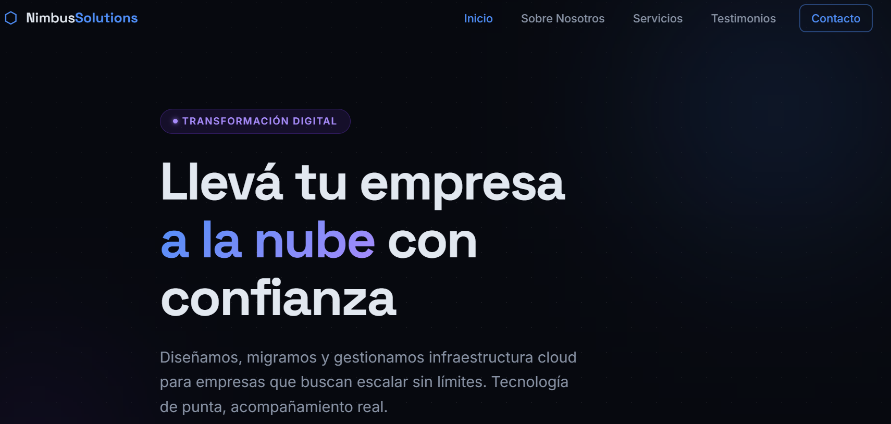

# PFO2 — Prompt Engineering en Agentes de IA

Comparación de la capacidad de resolución autónoma de dos agentes de desarrollo a partir de un único prompt inicial de alta precisión, aplicado a la generación de una Landing Page.

---

## Datos del estudiante

- **Nombre:** Santiago Cuda
- **Comisión:** Lunes
- **Instituto:** IFTS N.º 29
- **Fecha de entrega:** 26/6/2026

---

## Link al deploy unificado

🔗 **[https://pfo-2-prompt-engineering-nine.vercel.app](https://pfo-2-prompt-engineering-nine.vercel.app)**

La portada contiene los tres accesos requeridos: el prompt en texto plano y las dos landing pages generadas.

---

## Agentes utilizados

| | Agente | Modelo |
|---|---|---|
| **Agente 1** | Cursor | Composer 2.5 Fast |
| **Agente 2** | Claude Code | Claude Sonnet 4.6 |

Ambas landing pages fueron generadas con **el mismo prompt**, sin modificar el código manualmente, para evaluar la efectividad de la instrucción inicial.

---

## Prompt exacto utilizado

# Rol
Actuás como desarrollador front-end senior especializado en diseño web
moderno y experiencia de usuario. Tu tarea es construir una landing page
profesional, completa y lista para desplegar.

# Contexto del proyecto
La landing page es para una consultora de software y servicios cloud
ficticia llamada "Nimbus Solutions". La empresa ofrece migración a la nube,
desarrollo de software a medida e infraestructura gestionada. El público
objetivo son empresas medianas que quieren modernizar sus sistemas. El tono
debe ser profesional, confiable y tecnológico.

# Tarea
Generá una landing page de una sola página (single page) usando únicamente
HTML, CSS y JavaScript vanilla (sin frameworks, sin librerías externas, sin
dependencias de build). El resultado debe poder abrirse directamente con
doble clic en un archivo index.html y verse correctamente.

# Secciones obligatorias (en este orden)
1. Header: barra de navegación fija arriba con el logo "Nimbus Solutions" a
   la izquierda y un menú con enlaces a cada sección (Inicio, Sobre Nosotros,
   Servicios, Testimonios, Contacto). En mobile, el menú debe colapsar en un
   botón hamburguesa funcional.
2. Hero Section: título impactante, subtítulo descriptivo y un botón de
   llamada a la acción (CTA) bien visible. Fondo atractivo.
3. Sobre Nosotros: párrafo descriptivo de la empresa más algún dato o cifra
   destacada (ej. años de experiencia, proyectos completados).
4. Servicios: mínimo 3 tarjetas, cada una con ícono, título y descripción
   breve de un servicio.
5. Testimonios: mínimo 3 reseñas de clientes, cada una con nombre, cargo/
   empresa y el texto del testimonio.
6. Formulario de contacto: campos de nombre, email, asunto y mensaje, más un
   botón de envío. Solo maquetado visual, sin lógica de backend.
7. Footer: información de la empresa y enlaces a redes sociales (íconos o
   texto).

# Requisitos de diseño
- Diseño moderno, limpio y distintivo. Evitá explícitamente el aspecto
  genérico de plantilla. Cuidá la jerarquía visual, el espaciado y la
  tipografía.
- Totalmente responsive (debe verse bien en desktop, tablet y mobile).
- Paleta de colores coherente y profesional acorde a una empresa de
  tecnología.
- Animaciones o transiciones sutiles al hacer scroll o hover donde sumen.
- Navegación con scroll suave entre secciones al hacer clic en el menú.

# Requisitos técnicos
- Entregá el código en archivos separados: index.html, styles.css y
  script.js. No uses CDN ni recursos externos que requieran conexión
  (excepto fuentes de Google Fonts si las necesitás).
- Código limpio, ordenado y comentado en las secciones principales.
- El sitio debe ser completamente funcional al abrir index.html.

# Formato de salida
Creá todos los archivos necesarios en el directorio de trabajo. Al terminar,
indicá brevemente qué archivos generaste y cómo abrir el sitio.
\`\`\`

---

## Capturas de pantalla

### Landing Page — Agente 1 (Cursor · Composer 2.5 Fast)

### Landing Page — Agente 2 (Claude Code · Claude Sonnet 4.6)

---

## Comparativa y conclusiones

Ambos agentes resolvieron la consigna de forma autónoma y cumplieron con las siete secciones solicitadas, pero mostraron diferencias notables tanto en el proceso como en el resultado.

**Proceso:** Cursor (Composer 2.5 Fast) resolvió la tarea de forma muy rápida, priorizando la velocidad. Claude Code (Sonnet 4.6) tardó considerablemente más y consumió más tokens, dedicando más tiempo a razonar la estructura y el diseño antes de escribir el código.

**Resultado visual:** A pesar de partir del mismo prompt, las decisiones de diseño fueron distintas. Cursor optó por una paleta navy + cyan con tipografías Outfit y DM Sans, generando un resultado limpio y directo. Claude Code generó una interfaz en modo oscuro con gradientes azul-violeta, e incorporó elementos adicionales que no estaban pedidos explícitamente: más servicios que el mínimo solicitado, métricas destacadas, un badge de "más popular" y validación visual del formulario en tiempo real.

**Conclusión:** El experimento muestra que un mismo prompt puede producir resultados claramente diferentes según el agente, lo que confirma que la elección de la herramienta influye tanto como la redacción de la instrucción. Cursor con Composer 2.5 Fast resulta conveniente cuando se prioriza la velocidad de iteración, entregando un sitio correcto y sobrio en menos tiempo. Claude Code con Sonnet 4.6, en cambio, interpretó el prompt de manera más expansiva y produjo una interfaz más elaborada y con mayor atención al detalle, a costa de más tiempo y consumo de tokens. Para una landing page donde la presentación visual es determinante, el resultado de Claude Code se destaca; para prototipos rápidos o cuando el tiempo es la prioridad, Cursor cumple con eficiencia. En ambos casos, la calidad del prompt inicial fue lo que permitió que los dos agentes entregaran un sitio completo y funcional sin necesidad de correcciones manuales.

---

## Estructura del repositorio

\`\`\`
PFO2-Prompt-Engineering/
├── index.html              # Portada principal con los 3 accesos
├── prompt.txt              # Prompt exacto utilizado (texto plano)
├── cursor_composer2.5/     # Landing generada por el Agente 1
│   ├── index.html
│   ├── styles.css
│   └── script.js
├── claudecode_sonnet4.6/   # Landing generada por el Agente 2
│   ├── index.html
│   ├── styles.css
│   └── script.js
├── capturas/               # Capturas de pantalla de ambos sitios
│   ├── landing-cursor.png
│   └── landing-claude.png
└── README.md               # Este archivo
\`\`\`
